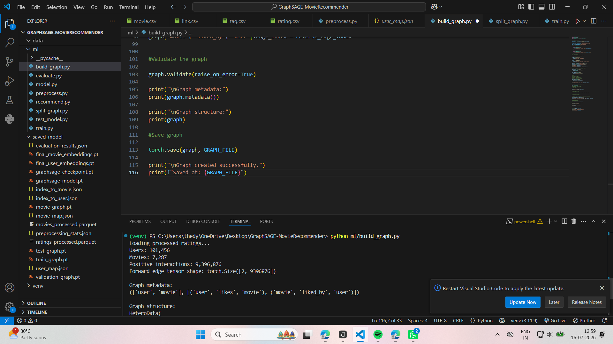
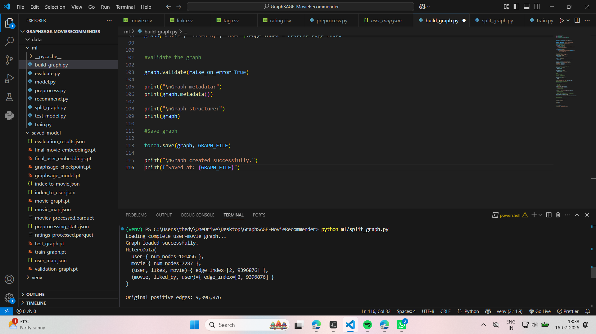
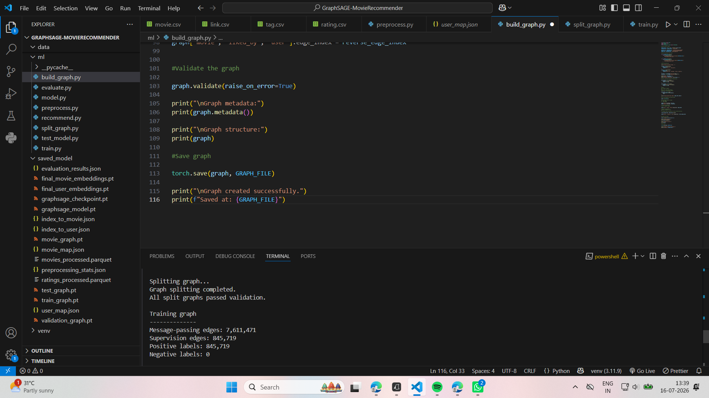
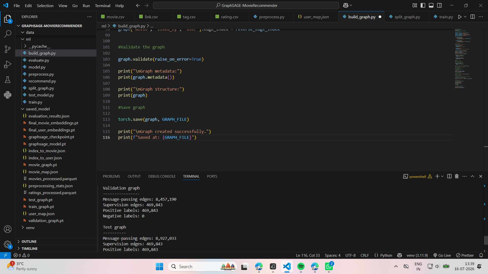
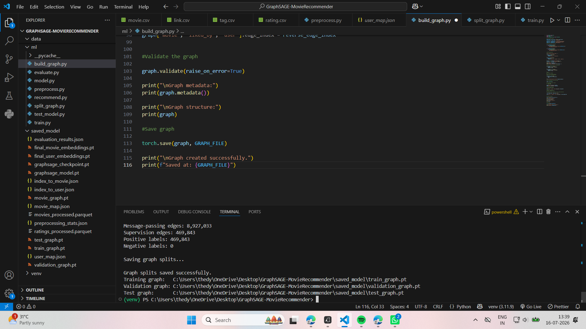
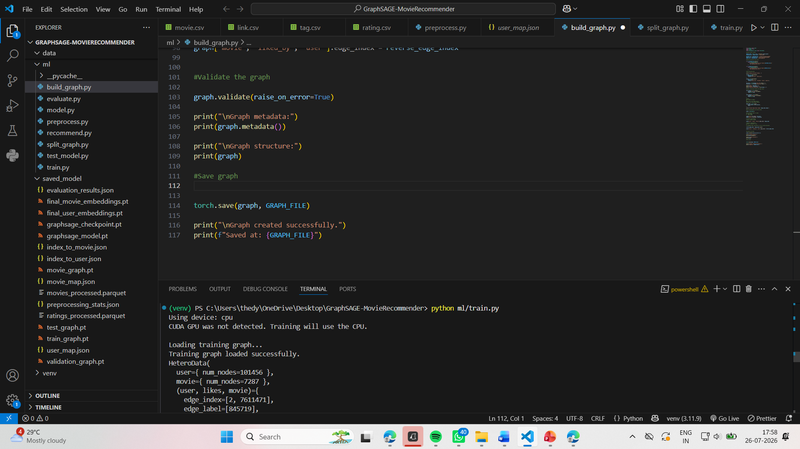
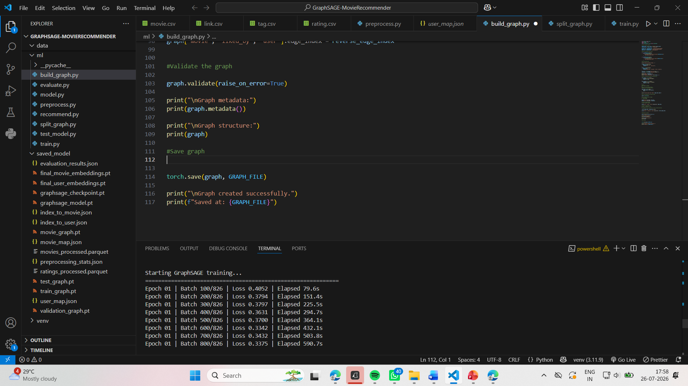
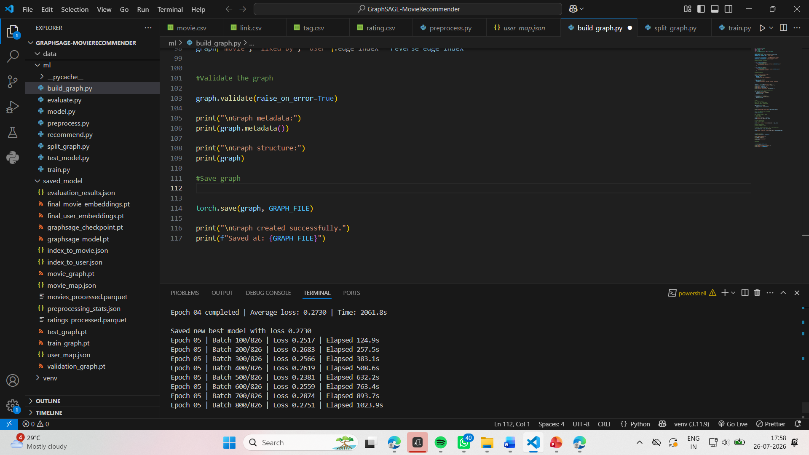

# Movie-Recommendation-System-
# GraphSAGE Movie Recommendation System

An end-to-end graph-based movie recommendation system built using **GraphSAGE**, **PyTorch Geometric**, and the **MovieLens 20M dataset**.

The project represents users and movies as nodes in a heterogeneous bipartite graph. Positive user–movie interactions are represented as edges, and GraphSAGE learns user and movie embeddings through neighborhood aggregation. These embeddings are later used to rank and recommend movies for a user.

## Project Objective

The objective of this project is to build a scalable recommendation pipeline that can answer:

> Given a set of movies a user likes, which unseen movies should be recommended next?

The project covers the complete machine-learning workflow:

- Raw-data preprocessing
- Positive interaction extraction
- Sparse user and movie filtering
- Heterogeneous graph construction
- Train, validation, and test edge splitting
- GraphSAGE model development
- Mini-batch link-prediction training
- Model evaluation
- Cold-start movie recommendation generation

## Key Skills Demonstrated

- Graph Neural Networks
- GraphSAGE
- Recommendation Systems
- Heterogeneous Graphs
- Link Prediction
- Neighborhood Sampling
- Negative Sampling
- Large-Scale Data Preprocessing
- PyTorch and PyTorch Geometric
- Model Evaluation
- Node Embeddings
- Cold-Start Recommendation
- Reproducible Machine-Learning Pipelines

## Technology Stack

- Python
- Pandas
- NumPy
- PyTorch
- PyTorch Geometric
- Scikit-learn
- Parquet
- JSON
- Visual Studio Code

## Dataset

This project uses the **MovieLens 20M Dataset**, a widely used benchmark dataset for building and evaluating movie recommendation systems. The dataset is provided by the GroupLens Research Lab at the University of Minnesota.

The dataset contains approximately:

* 20 million user ratings
* 138,000+ users
* 27,000+ movies

The raw dataset includes the following files:

* `rating.csv`
* `movie.csv`
* `tag.csv`
* `link.csv`

For this project, the recommendation pipeline primarily uses **`rating.csv`** and **`movie.csv`**.

* **`rating.csv`** contains user IDs, movie IDs, ratings, and timestamps. It is used to build the user–movie interaction graph.
* **`movie.csv`** contains movie IDs, movie titles, and genres. It is used to display meaningful movie recommendations to the user.

The remaining files (`tag.csv` and `link.csv`) are not used in the current implementation but can be incorporated in future versions to build richer graph features and hybrid recommendation models.

## Development Environment

The complete project was designed, implemented, and executed locally using Visual Studio Code as the primary development environment. All stages of the machine learning pipeline- including data preprocessing, graph construction, model development, training, evaluation, and recommendation generation- were implemented as individual Python scripts and executed sequentially through the Visual Studio Code terminal.

A dedicated Python virtual environment (venv) was used to manage project dependencies and ensure a reproducible execution environment throughout development.

The source code for the entire pipeline is organized inside the ml/ directory, where each script is responsible for a specific stage of the recommendation system. The scripts are executed in sequence, with the output of one stage serving as the input for the next stage.

This GitHub repository serves as a portfolio representation of the project and contains the complete source code, execution screenshots, preprocessing statistics, evaluation results, and sample recommendation outputs.

---

## Preprocessing Results

### Original Dataset Statistics

| Metric | Count |
|--------|-------:|
| Original Ratings | 20,000,263 |
| Original Users | 138,493 |
| Original Movies | 27,278 |

### Dataset After Filtering

| Metric | Count |
|--------|-------:|
| Active Users | 101,456 |
| Remaining Movies | 7,287 |
| Positive User–Movie Interactions | 9,396,876 |

The preprocessing stage successfully reduced the dataset by removing inactive users and rarely rated movies, resulting in a cleaner and denser interaction graph suitable for GraphSAGE training.

---

## Generated Files

The preprocessing stage generates the following files inside the `saved_model/` directory.

| File | Description |
|------|-------------|
| `ratings_processed.parquet` | Stores the cleaned positive user–movie interactions after preprocessing. |
| `movies_processed.parquet` | Stores the filtered movie metadata corresponding to the remaining movies. |
| `user_map.json` | Maps original MovieLens user IDs to continuous graph node indices. |
| `movie_map.json` | Maps original MovieLens movie IDs to continuous graph node indices. |
| `index_to_user.json` | Reverse mapping from graph node indices back to the original user IDs. |
| `index_to_movie.json` | Reverse mapping from graph node indices back to the original movie IDs. |
| `preprocessing_stats.json` | Stores preprocessing configuration and final dataset statistics for reproducibility. |

---

## Preprocessing Output


.png)

**Figure.** Successful execution of the preprocessing pipeline showing dataset loading, iterative filtering, final graph statistics, and the generated preprocessing artifacts.

---

## Source Code

The implementation for this stage can be found here:

**[📄 preprocess.py](ml/preprocess.py)**

# 2. Graph Construction

## Overview

The second stage of the project converts the processed MovieLens dataset into a heterogeneous graph representation that can be directly used by the GraphSAGE Graph Neural Network.

Unlike traditional recommendation systems that operate on tabular data, Graph Neural Networks require the dataset to be represented as interconnected nodes and edges. In this project, every user and every movie becomes a graph node, while every positive user–movie interaction becomes an edge connecting the two.

The graph is built using the PyTorch Geometric `HeteroData` object, which supports multiple node types and relationship types.

---

## Graph Construction Workflow

The graph construction pipeline performs the following operations:

1. Loads the processed datasets generated during preprocessing.
2. Reads the graph node indices (`user_idx` and `movie_idx`).
3. Converts the interaction table into PyTorch tensors.
4. Creates the forward edge tensor representing **User → Likes → Movie** relationships.
5. Generates reverse edges representing **Movie → Liked By → User** relationships.
6. Creates a heterogeneous graph using the `HeteroData` data structure.
7. Adds user nodes and movie nodes to the graph.
8. Validates the graph structure to ensure that all node indices and edge connections are correct.
9. Saves the complete heterogeneous graph for the training stage.

---

## Graph Representation

The graph contains two different node types:

- User
- Movie

It also contains two directed edge relationships:

```
User ───── likes ─────► Movie
Movie ── liked_by ───► User
```

The reverse edges are included to allow GraphSAGE to propagate information in both directions during message passing.

---

## Graph Statistics

After graph construction:

- User Nodes: **101,456**
- Movie Nodes: **7,287**
- Positive User–Movie Interactions: **9,396,876**
- Forward Edge Tensor Shape: **[2, 9,396,876]**

The heterogeneous graph contains:

- User node type
- Movie node type
- User → Likes → Movie edges
- Movie → Liked By → User edges

---

## Generated File

The graph construction stage generates the following file inside the `saved_model/` directory.

| File | Purpose |
|------|---------|
| movie_graph.pt | Stores the heterogeneous graph used during graph splitting and GraphSAGE training. |

---

## Graph Construction Output

### Terminal Execution

.png)


---

## Source Code

The complete implementation for this stage can be found here:

📄 [build_graph.py](ml/build_graph.py)

---

# 3: Graph Splitting

After constructing the complete heterogeneous user–movie graph, the next step is to divide it into separate **training**, **validation**, and **test** graphs.

This stage is implemented in:

📄 **[split_graph.py](ml/split_graph.py)**

The purpose of this stage is to prepare independent datasets for model training and evaluation while preventing data leakage. Each graph contains different supervision edges but preserves enough message-passing edges for GraphSAGE to learn meaningful user and movie embeddings.

The graph splitting pipeline performs the following operations:

1. Loads the heterogeneous graph generated by `build_graph.py`.
2. Reads the complete user–movie interaction graph.
3. Randomly partitions positive user–movie interactions into Training, Validation, and Test sets.
4. Preserves message-passing edges required for GraphSAGE neighborhood aggregation.
5. Assigns supervision edges for link prediction during model training.
6. Validates each split to ensure graph consistency.
7. Saves the generated graph splits for the training stage.

---

## Graph Split Distribution

The original graph contains:

- **Users:** 101,456
- **Movies:** 7,287
- **Positive interactions:** 9,396,876

The interactions are divided into three graph datasets.

| Dataset | Message Passing Edges | Supervision Edges |
|----------|----------------------:|------------------:|
| Training Graph | 7,611,471 | 845,719 |
| Validation Graph | 8,457,190 | 469,843 |
| Test Graph | 8,927,033 | 469,843 |

Each graph passes PyTorch Geometric validation before being saved.

---

## Files Generated

The graph splitting stage generates the following files inside the `saved_model/` directory.

| File | Purpose |
|------|----------|
| `train_graph.pt` | Training graph used to learn GraphSAGE embeddings. |
| `validation_graph.pt` | Validation graph used for hyperparameter tuning and model selection. |
| `test_graph.pt` | Test graph reserved for final evaluation of the recommendation model. |

---

# Graph Loading

The graph generated during the previous stage is successfully loaded into memory before splitting.

The terminal output confirms:

- Successful graph loading
- Node statistics
- Edge statistics
- Total positive interactions available for splitting



**Figure.** Loading the heterogeneous user–movie graph generated during the graph construction stage.

---

# Graph Splitting Results

The graph is successfully divided into training, validation, and testing datasets.

The terminal output displays:

- Training graph statistics
- Validation graph statistics
- Test graph statistics
- Number of message-passing edges
- Number of supervision edges
- Positive labels for each graph



**Figure.** Successful graph partitioning into training, validation, and test datasets.

---

# Saved Graph Files

Finally, the generated graph datasets are saved for the next stage of the recommendation pipeline.

The terminal confirms creation of:

- `train_graph.pt`
- `validation_graph.pt`
- `test_graph.pt`



**Figure.** Successfully saving the graph splits for GraphSAGE training.


---

## Source Code

The complete implementation for this stage can be found here:

📄 **[split_graph.py](ml/split_graph.py)**

---
# 4: GraphSAGE Model Training

The fourth stage of the project trains a **GraphSAGE** model on the user–movie interaction graph created in the previous stages. During training, the model learns low-dimensional embeddings for users and movies by aggregating information from neighboring nodes. These embeddings capture collaborative filtering patterns and serve as the foundation for generating personalized movie recommendations.

The training pipeline performs the following operations:

1. Loads the training, validation, and testing graph splits generated by `split_graph.py`.
2. Initializes the heterogeneous GraphSAGE model for user and movie node types.
3. Converts the heterogeneous graph into a format compatible with GraphSAGE.
4. Initializes the model using a sampled mini-batch before training.
5. Trains the model using mini-batch neighbor sampling.
6. Performs forward propagation to generate user and movie embeddings.
7. Computes link prediction scores for user–movie interactions.
8. Calculates the Binary Cross-Entropy loss between predicted and actual interactions.
9. Updates model parameters through backpropagation using the Adam optimizer.
10. Repeats the training process for multiple epochs while monitoring the training loss.
11. Saves the best-performing GraphSAGE model based on the minimum training loss.
12. Stores a training checkpoint for resuming training if required.

---

## Training Configuration

| Parameter | Value |
|-----------|-------|
| Graph Neural Network | GraphSAGE |
| Dataset | MovieLens 20M |
| Node Types | User, Movie |
| Learning Task | Link Prediction |
| Optimizer | Adam |
| Loss Function | Binary Cross Entropy |
| Training Method | Mini-batch Neighbor Sampling |
| Epochs | 5 |

---

## Training Progress

During training, the GraphSAGE model gradually reduced the Binary Cross-Entropy loss over successive epochs, indicating that it successfully learned meaningful representations of users and movies.

| Epoch | Average Training Loss |
|--------|----------------------:|
| 1 | 0.3764 |
| 2 | 0.3116 |
| 3 | 0.2887 |
| 4 | 0.2730 |
| 5 | **0.2623** |

The continuous decrease in loss demonstrates that the model converged effectively and learned increasingly informative node embeddings throughout training.

---

## Files Generated

The training stage creates the following files inside the `saved_model/` directory.

| File | Purpose |
|------|----------|
| `graphsage_model.pt` | Stores the best trained GraphSAGE model parameters. |
| `graphsage_checkpoint.pt` | Stores the latest training checkpoint for resuming training if required. |

---

## Running the Training Pipeline

Execute the following command from the project root directory:

```bash
python ml/train.py
```

---

## Training Output

### Model Initialization

The GraphSAGE model is initialized using one sampled mini-batch before the actual training begins.



---

### Training Progress (Epoch 1)

The first epoch begins training using mini-batches generated through neighbor sampling. The training loss decreases as batches are processed.



---

### Training Progress (Epoch 2)

The model continues learning meaningful user and movie representations with a lower average loss than the previous epoch.


---

### Training Progress (Epoch 3)

The loss continues to decrease, indicating improved link prediction performance.


---

### Training Progress (Epoch 4)

Further optimization results in lower training loss and improved learned embeddings.


---

### Training Progress (Epoch 5)

The final training epoch produces the lowest loss achieved during optimization.



---

### Training Completion

After all epochs finish, the best-performing GraphSAGE model and the latest checkpoint are automatically saved for later evaluation and recommendation generation.


---

## Source Code

The implementation for this stage can be found here:

📄 **[train.py](ml/train.py)**

## 5. Model Testing and Forward-Pass Verification

After training the GraphSAGE recommendation model, the next stage verifies that the trained model architecture can successfully process user–movie edges and generate prediction scores.

The testing workflow is implemented in:

```text
ml/test_model.py
```

Run the testing script from the project root using:

```bash
python ml/test_model.py
```

### Purpose of `test_model.py`

The purpose of this stage is to verify that the complete GraphSAGE architecture is functioning correctly before performing full recommendation-system evaluation.

The script performs the following workflow:

```text
Load Training Graph
        ↓
Recover Graph Metadata
        ↓
Initialize GraphSAGE Model
        ↓
Construct Heterogeneous GraphSAGE Layers
        ↓
Select Sample User–Movie Edges
        ↓
Perform Forward Pass
        ↓
Generate Link-Prediction Scores
        ↓
Verify Output Shape
```

---

### Loading the Training Graph

The script first loads the previously generated training graph.

The graph contains two node types:

```text
User nodes  : 101,456
Movie nodes : 7,287
```

The graph metadata identifies the heterogeneous relationships used by GraphSAGE:

```text
('user', 'likes', 'movie')
('movie', 'liked_by', 'user')
```

These two directed relations represent the bipartite user–movie interaction graph.

Conceptually:

```text
User ───── likes ─────> Movie

User <─── liked_by ─── Movie
```

The reverse relation allows information to propagate in both directions during GraphSAGE message passing.

---

### GraphSAGE Model Architecture

The testing script reconstructs the recommendation model using the same architecture used during training.

The model contains learnable embeddings for both node types:

```text
User Embedding:
Embedding(101456, 64)

Movie Embedding:
Embedding(7287, 64)
```

Therefore, every user and every movie initially receives a learnable **64-dimensional representation**.

The GraphSAGE encoder then performs neighborhood aggregation over the heterogeneous graph.

The first GraphSAGE layer produces:

```text
128-dimensional hidden representations
```

and the second GraphSAGE layer produces:

```text
64-dimensional final node embeddings
```

The architecture can therefore be summarized as:

```text
User / Movie IDs
       ↓
64-D Learnable Embeddings
       ↓
GraphSAGE Layer 1
       ↓
128-D Hidden Representations
       ↓
GraphSAGE Layer 2
       ↓
64-D Graph-Aware Embeddings
       ↓
Dot Product Decoder
       ↓
User–Movie Compatibility Score
```

GraphSAGE uses **mean aggregation** to combine information from neighboring nodes.

For a node \(v\), neighborhood information can conceptually be represented as:

```math
h_{\mathcal{N}(v)}
=
\operatorname{MEAN}\left(\{h_u : u \in \mathcal{N}(v)\}\right)
```

The node's representation is then updated using information from both the node itself and its neighborhood.

---

### Dot-Product Decoder

After GraphSAGE generates user and movie embeddings, the model uses a dot-product decoder to score a candidate user–movie pair.

For user embedding \(z_u\) and movie embedding \(z_m\):

```math
s(u,m) = z_u^{T} z_m
```

where:

- \(z_u\) = learned user embedding
- \(z_m\) = learned movie embedding
- \(s(u,m)\) = predicted compatibility score

A larger score indicates that the learned representations consider the user and movie more compatible.

---

### Testing Sample User–Movie Edges

The testing script selects a small sample of edges from the test edge-label index.

Example output:

```text
Test edge-label index:

tensor([[18871,  6986, 54383, 85366, 57439],
        [  542,  3708,  4470,  1344,  3560]])
```

The tensor has shape:

```text
[2, 5]
```

Each column represents one user–movie pair.

For example:

```text
User 18871 → Movie 542
User  6986 → Movie 3708
User 54383 → Movie 4470
User 85366 → Movie 1344
User 57439 → Movie 3560
```

These IDs correspond to the **internal graph indices** used by the model rather than necessarily the original MovieLens IDs.

---

### Forward-Pass Results

The selected user–movie edges are passed through the GraphSAGE model.

Example output:

```text
Predicted scores:

tensor([ 0.0206,
         0.0064,
        -0.0148,
         0.0253,
         0.0015])
```

The model therefore generates exactly one prediction score for each candidate edge.

The resulting output shape is:

```text
torch.Size([5])
```

This confirms the expected relationship:

```text
5 input user–movie pairs
        ↓
GraphSAGE Encoder
        ↓
Dot-Product Decoder
        ↓
5 prediction scores
```

The successful execution ends with:

```text
Model forward pass completed successfully.
```

This verifies that the graph representation, heterogeneous GraphSAGE layers, node embeddings, decoder, and prediction pipeline are dimensionally compatible and can execute end-to-end.

---

### Test Model Output

The following screenshots show the execution of `test_model.py`.

#### Loading the Graph and Creating the Model


The script successfully loads the training graph containing **101,456 users** and **7,287 movies** and reconstructs the GraphSAGE recommendation architecture.

#### GraphSAGE Architecture


The reconstructed model contains user and movie embeddings, two heterogeneous GraphSAGE convolution layers, and a dot-product decoder.

#### Test Edge Selection


A sample of user–movie pairs is extracted from the test edge-label index and passed through the recommendation model.

#### Prediction Scores and Forward-Pass Verification


The model generates one score for every supplied user–movie pair and successfully completes the forward pass.

---

### Testing Stage Summary

| Component | Result |
|---|---|
| Training graph loaded | Successful |
| Number of users | 101,456 |
| Number of movies | 7,287 |
| User embedding dimension | 64 |
| Movie embedding dimension | 64 |
| GraphSAGE hidden dimension | 128 |
| Final embedding dimension | 64 |
| Aggregation method | Mean |
| Decoder | Dot Product |
| Sample test edges | 5 |
| Output scores | 5 |
| Output shape | `torch.Size([5])` |
| Forward pass | Successful |

The successful forward-pass test confirms that the GraphSAGE recommendation architecture is operational and ready for the next stage: **quantitative evaluation of recommendation/link-prediction performance**.


